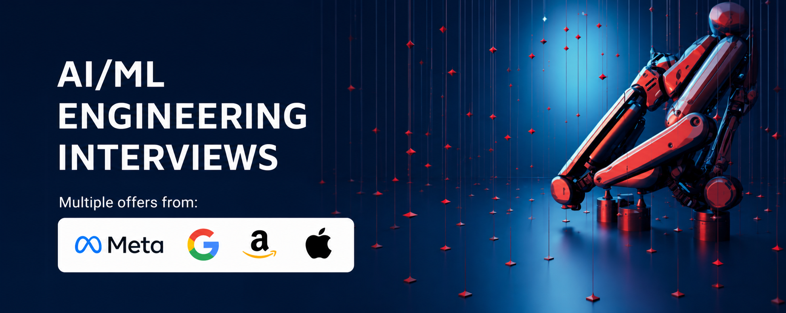

       
# AI / Machine Learning Interviews :robot: 

This repo aims to serve as a guide to prepare for **AI and ML Technical interviews** for relevant roles at big tech companies (in particular FAANG). It has compiled based on the author's personal experience and notes from his own interview preparation, when he received 5 simultaneous offers from Meta (ML Specialist), Google (ML Engineer), Amazon (Applied Scientist), Apple (Applied Scientist), and Roku (ML Engineer) in 2020, and repeated offers from Amazon and Apple in 2025 (AI Tech Lead).

> **Remember:** Interviewing is a skill and the more skillful you are, the better the results will be.

The following components are the most commonly used interview modules for technical ML roles at different companies. We will go through them one by one and share how one can prepare:

 |Chapter | Content|
 |---| --- |
 | Chapter 1 	|  [General Coding - DSA (Data Structures and Algorithms)](src/lc-coding.md)	   | 
| Chapter 2 	| [ML Coding](src/MLC/ml-coding.md) 	|  	
| Chapter 3	| [ML Fundamentals/Breadth (classic ML, LLMs, multimodal AI, and more)](src/ml-fundamental.md)| 
| Chapter 4 	| [ML/GenAI/LLM System Design](src/MLSD/ml-system-design.md)|
| Chapter 5 	| [Agentic AI Systems](https://github.com/alirezadir/Agentic-AI-Systems.git)|
| Chapter 6 	| [Behavioral Interviews](src/behavior.md)| 
| Resources 	| [GenAI Learning Resources](src/genai-resources.md)|
|  	|  	|  

## News

I now offer **1:1 AI/ML interview coaching & mock interviews** for AI/ML Engineers, Applied AI Scientists, Research Engineers, Research Scientists, AI Strategists, Engineering Managers, and senior AI leaders.

Topics include technical interviews (AI/ML system design, GenAI & Agentic AI fundamentals, ML fundamentals, AI coding, and more), behavioral interviews, and leadership interviews.

Learn more: [https://aimlinterviews.io](https://aimlinterviews.io)

---

:newspaper: This repository is now **AIMLInterviews**, updated for 2026 with expanded LLM, multimodal AI, post-training, and GenAI system-design content.

**Notes:**
* AI and ML interviews at different companies do not follow a unique structure. However, I found the components very similar across FAANG companies. Startup interviews are often tailored to their own use cases and problems at hand, while larger companies tend to follow a more consistent structure.

* The guide here is mostly focused on *AI / ML Engineering, Applied Science, Tech Lead* roles at big companies. Although relevant roles such as "Data Science" or "Research scientist" have different structures in interviews, some of the modules reviewed here can be still useful. 

# Contribution
* Feedback and contribution are very welcome :blush: 
**If you'd like to contribute**, please make a pull request with your suggested changes). 
